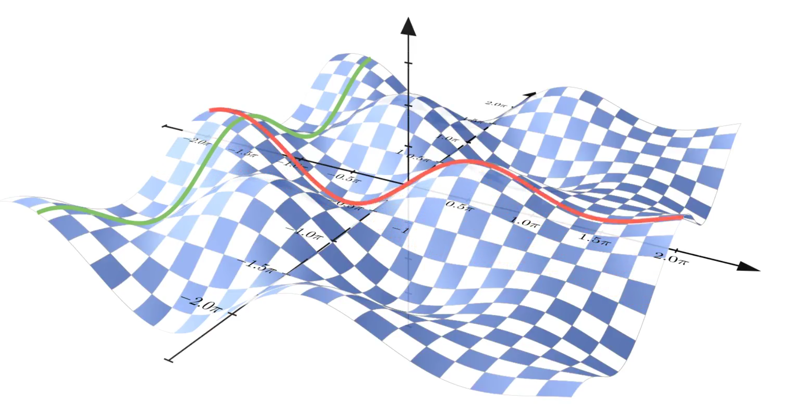
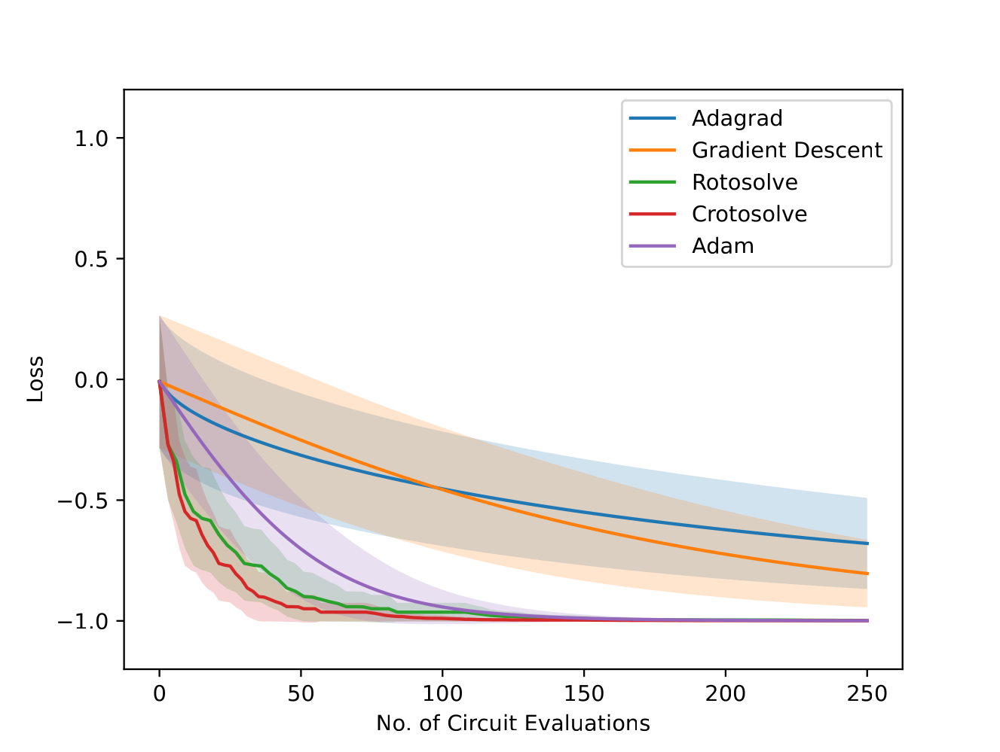

For my bachelor's thesis at the Karlsruhe Institute of Technology (KIT), I had
the pleasure to work on a research project with Dr. Eileen Kühn, Dr. Max Fischer
and Prof. Achim Streit.
Their lab at KIT's Scientific Computing Center had stumbled upon a neat property
of univariate parameter changes in parameterised quantum circuits (PQCs).
Namely, plotting the expectation value of any measurement after a PQCs w.r.t. a
single parameter used in a Pauli rotation gate will always produce a (possibly
shifted and scaled) sine function.
This characteristic was also discovered earlier by
[Ostaszewski et al.](https://doi.org/10.22331/q-2021-01-28-391) and used for a
univariate optimisation algorithm called
[`Rotosolve`](https://docs.pennylane.ai/en/stable/code/api/pennylane.RotosolveOptimizer.html),
which evaluates the PQC three times to reconstruct the sine function and compute
the optimal parameter value, for each parameter.

  
   
  <i>
    <b>Fig. 1:</b> The expectation value of a measurement is plotted w.r.t. two
    parameters for Pauli rotation gates.
    The green and red lines demonstrate that both expectation values have an
    univariate, sinusoidal dependency on the parameters.
  </i>

The original approach based on the sine shape was limited to optimising PQCs
where each parameter is used in one Pauli rotation gate.
However, another commonly used gate in PQCs is the *controlled* Pauli rotation
gate which spans two qubits.
A parameter used in this type of gate no longer produces a sinusoidal
expectation function but a $4\pi$-periodic wave-like function.

The goal for my bachelor's thesis was to characterise this type of function and
to develop an extension to the `Rotosolve` algorithm that could handle both
regular Pauli rotation gates and controlled ones.
Indeed, the expectation value function of controlled Pauli rotation gates is a
superposition of two sine waves with different speeds which can be characterised
by five scalar values.
My `Rotosolve` extension -- called `Crotosolve` -- can reconstruct these
functions from five PQC evaluations and leverage onedimensional, numerical
optimisation algorithms to compute the (univariately) best parameter value.
Compared with `Rotosolve` and standard quantum machine learning optimisers,
`Crotosolve` consistently exhibits comparable or better loss curves on a
PQC benchmark[^evaluation].

[^evaluation]:
    It should be noted that the performance of QML optimisers can often be
    improved through hyperparameter tweaking.
    Here, we only consider these optimisers with their default values and
    highlight that `Crotosolve` works well and consistently out of the box.
    The benchmark is based on a PQC library proposed by
    [Sim et al.](https://doi.org/10.1002/qute.201900070) and all evaluation
    details are presented in Section 5.2 of the
    [thesis](./bachelors-thesis.pdf).

* 📖 [Read my bachelor's thesis](./bachelors-thesis.pdf)
* 🆓 Check out the data and source code on
  [GitHub](https://github.com/schweikart/crotosolve) or
  [Zenodo](https://doi.org/10.5281/zenodo.10413938)

  
   
  <i>
    <b>Fig. 2:</b> Various optimizers minimize the expectation of a PQC with
    four qubits and three layers.
    Full lines show the average loss curve.
    Transparent areas show the error, which is the average ± its standard
    deviation.
  </i>

