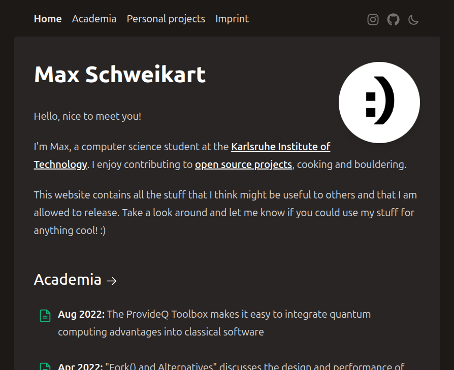

This self-referential page documents technical work on this website.
For the actual content, have a look at the [home page](/).

# 2022: The original content wind page
After having been in touch with web development for over half a dozen years, I
decided to finally build a website for myself to collect all the various public
things I've been working on in a single space.
I had thought about different design ideas for my website for a long time but
since I've never found the time to fully prepare those first, I chose to build
on top of an existing solution as a start.
As I had been experimenting with [Nuxt](https://nuxtjs.org/) for a while, I
created my site based on the Nuxt creator's
[content-wind](https://github.com/Atinux/content-wind) template which was built
on [Nuxt Content](https://content.nuxtjs.org/) and
[TailwindCSS](https://tailwindcss.com/).

  
   
  <b>Fig. 1:</b> The first iteration of this website was pretty minimal,
  consisting of only four pages.

# 2026: Switching to Quartz
With some free time at hand after graduating from my master's degree, I gave
this website a direly needed overhaul.
The content of this site hadn't been updated in over three years, a period in
which a lot has changed in my life.

But when an npm security audit revealed 171 vulnerabilities [^npm-audit] among
the many outdated dependencies of the project, I wanted to give the site a
technical upgrade first.
However, that turned out to be difficult since
[Content Wind](https://github.com/atinux/content-wind) is distributed as a
template without an upgrade mechanism.
Upgrading all individual dependencies to their latest version didn't work out
either (it never does) with the project being unable to start afterwards and the
looming time investment required for working through roughly a dozen upgrade
guides for a foreign codebase seemed out of balance for this hobby project.

[^npm-audit]:
    NPM's audit functionality has been
    [criticised](https://overreacted.io/npm-audit-broken-by-design/#why-is-npm-audit-broken)
    in the past because it can't assess whether vulnerable dependencies are
    relevant in the context of the actual project.
    Many of the 171 reported vulnerabilities were indeed irrelevant to the
    website code but the sheer number prevented me from carrying out a proper
    assessment in this side project.
    As the number of reported vulnerabilities roughly correlates with the
    outdatedness of the project's dependencies, I still believe it to be a
    sensible first indicator of technical debt.

I had been on the lookout for a better markdown-based website template for a
while and when I came across
[Mario Román's homepage](https://www.marioroman.xyz/) while researching PhD
positions, it clicked.
Mario's site was based on [Quartz](https://quartz.jzhao.xyz/), which reminded me
a lot of [Obsidian](https://obsidian.md/) and [Notion](https://www.notion.so/) 
thanks to its knowledge graph and its minimal layout.
Quartz supports many of the features I had missed on my own site out of the box
including full-text search, tagging and the general organisation into pages.

Reorganising my content to fit Quartz's structure didn't take long and I could
quickly shift my focus towards writing new content.
So far, I love the rich
[feature availability](https://quartz.jzhao.xyz/features/) that makes the
website feel clean and modern while sticking to standard
markdown[^extended-markdown] for content authoring.
While I appreciate Quartz's built-in update mechanism, I would prefer to
separate the site generator from the actual content.
We'll see how that plays out.

[^extended-markdown]:
    Quartz's markdown support actually goes beyond standard markdown, including
    features like callouts/notes and LaTeX support from
    [Obsidian](https://quartz.jzhao.xyz/plugins/ObsidianFlavoredMarkdown) and
    [GitHub flavoured markdown](https://quartz.jzhao.xyz/plugins/GitHubFlavoredMarkdown).

- 👀 [Take a look at the home page](/)
- 🏗️ [Find the source code on GitHub](https://github.com/schweikart/maxschweik.art-quartz)
- 📧 [Tell me what you think about this site](mailto:website@maxschweik.art)
